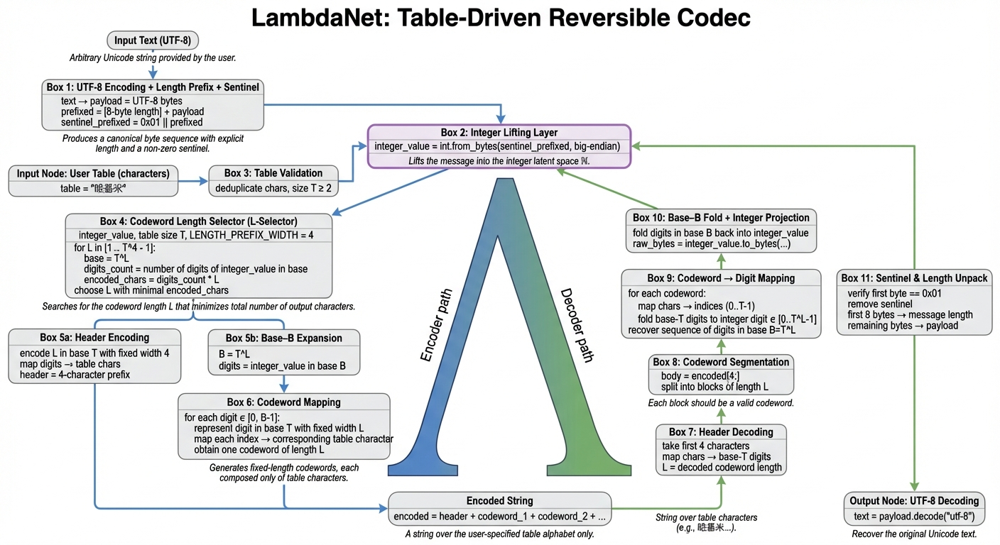

# Rhakimi: a table-driven reversible encoder

Rhakimi (a French-derived word whose English pronunciation is similar to *ha-ji-mi*) is an intentionally over-engineered, academically straight-faced V-shaped encoding system that lifts UTF-8 text into an integer latent; expands it within a high-radix space induced by a user-specified table (e.g., `"哈基米"`); and projects it back into a fixed-length codeword stream composed exclusively of table characters.

Decoding inverts every layer exactly, including the sentinel byte and explicit length prefix, enabling fully deterministic recovery even when the encoded output looks like a deranged scripture in a custom alphabet.



Although Rhakimi is not a neural network, its structure resembles a degenerate U-Net: an Encoder leg descending into the integer latent space, and a Decoder leg ascending symmetrically back into a character space. For theatrical accuracy, we refer to this topology as LambdaNet.

Rhakimi is the Python module implementing LambdaNet.

## Overview

Given a user-defined table such as `"哈基米"` (or `"一二三四"`, `"ABC"`, `"🌶🔥😂"`, etc.), Rhakimi constructs a high-radix representational space in which each digit corresponds to a fixed-length codeword over the table. The system chooses the codeword length adaptively to minimize total output length — a trivial discrete optimization framed as something more dramatic.

The resulting encoded output is reversible, deterministic, and aesthetically confusing. Rhakimi provides zero cryptographic protection unless combined with actual cryptography; its purpose is recreational, artistic, or chaotic.


## System architecture (LambdaNet)

Rhakimi’s LambdaNet pipeline can be summarized as the following reversible V-shaped mapping:

```
UTF-8 text
   ↓  (UTF-8 encode + length prefix + sentinel)
bytes
   ↓  (integer lifting)
ℤ (latent integer space)
   ↓  (high-radix expansion induced by table)
digit sequence
   ↓  (digit → fixed-length codewords)
table-character stream

```

Decoding follows the exact inverse sequence.

A more structured architecture depiction is described below:


## System sketch

- Table validation (Rhakimi.TableValidator)

  - Deduplicates characters while preserving order. ≥2 distinct symbols required:
"哈哈哈哈哈一二三四" → "哈一二三四".

- Payload prefixing (Rhakimi.PayloadLayer)

  1. UTF-8 encode the input.
  2. Prefix its length with an 8-byte big-endian integer.
  3. Prepend a sentinel byte 0x01 to disambiguate leading zeros.

- Integer lifting (Rhakimi.IntegerLatent)

  - Interpret the full byte sequence as a single big-endian integer representing the latent z ∈ ℤ.

- Codeword length selection (Rhakimi.LSelector)

  - For table size T and header width HEADER = 4, scan
L ∈ [1, T^HEADER − 1],
  - choosing the L that minimizes total emitted characters.
The effective base becomes B = T^L.

- Header encoding (Rhakimi.HeaderCodec)
  - Encode L in base T using exactly four 1-symbol digits drawn from the table.

- Digit expansion & projection (Rhakimi.CodewordProjector)

    - Expand latent integer in base B.

    - For each digit:

      - convert to an L-wide base-T tuple,

      - map each element to the corresponding table character.

    - Concatenate all codewords to produce the final encoded stream.

- Decoder symmetry (Rhakimi.DecoderLeg)
  - Reads the 4-character header to restore L, slices fixed-length codewords, folds digits back to the latent integer, verifies sentinel and length prefix, and UTF-8 decodes the payload.

Every transformation in Rhakimi is strictly invertible.

## Quick start (uv)

```bash
# install deps (none beyond stdlib; ensures uv env exists)
uv run python -m rhakimi
```

## Library usage

```python
from rhakimi import ReversibleTableCodec

codec = ReversibleTableCodec()
table = "哈基米"  # any >=2 distinct chars; duplicates are removed in-order
encoded = codec.encode(table, "Hello, 世界")
decoded = codec.decode(table, encoded)
assert decoded == "Hello, 世界"
```

## Testing (pytest via uv)

```bash
uv run pytest
```

## Closing remarks

The Rhakimi module — implementing the LambdaNet reversible encoder — was created largely because someone (nobody) asked:

> “Can we transform a normal sentence into a long text made entirely of ‘哈基米’, and still decode it perfectly?”

Yes.
And now you can do it with:

- table-driven high-radix spaces,
- fixed-length codewords,
- an integer latent representation,
- a sentinel byte,
- a four-digit base-T header,
- and a Λ-shaped architecture diagram.

Over-engineering is international and timeless.

## Cite this work

If you use Rhakimi or LambdaNet in academic, recreational, or exceedingly unserious contexts, please cite:

```
@misc{chen2025Rhakimi,
  title        = {Rhakimi: A Table-Driven Reversible Encoder via the LambdaNet Architecture},
  author       = {Lumis, Chen},
  year         = {2025},
  howpublished = {\url{https://github.com/luminolt/rhakimi}},
  note         = {An intentionally over-engineered V-shaped pipeline for lifting UTF-8 text into integer latent space and projecting into fixed-length table codewords.}
}
```